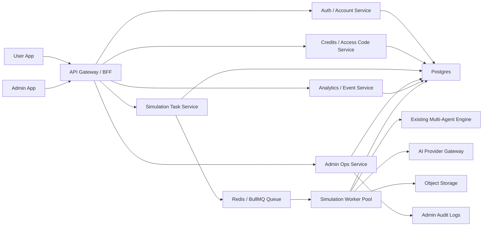

# TryItOut Platformized Commercial Admin Design

## Context

TryItOut is moving from a React + Express local prototype into a commercial platform that can support paid beta users, access-code driven credits, controlled simulation execution, model-cost visibility, and real admin operations.

The current repository already has the core multi-agent simulation engine, file-backed simulation tasks, validation events, model call logs, and a commercial MVP design. It does not yet have a real user account system, commercial credit ledger, access-code implementation, queue-backed paid task flow, or production-grade admin dashboard.

Local operational data shows why this must be treated as a platform rather than a small admin screen:

- `output/validation/events.jsonl` already contains registration-like funnel signals such as simulation requests, report views, paywall clicks, leads, deep-mode requests, and failures.
- `output/simulation-tasks/*` already contains durable task records, reports, checkpoints, and step-run token usage.
- Deep-mode tasks can be expensive and slow; the current in-request/file-backed path is not a safe commercial execution model.
- Access codes must represent credits and entitlements, not just display strings.

## Goals

- Build a real commercial platform with separated user app, admin app, API/BFF, commercial services, simulation workers, Postgres persistence, Redis/BullMQ queues, and auditable admin operations.
- Make the admin backend useful for daily operations: user management, access-code operations, credits auditing, task monitoring, queue health, worker status, model cost, feedback, events, settings, and audit logs.
- Make access codes practical and secure: full codes are copyable/exportable only at creation time; persistent storage keeps hashes plus masked display values.
- Protect commercial mode so unauthenticated legacy endpoints cannot bypass credits.
- Preserve the existing simulation engine while moving commercial-critical orchestration to a transactional, queue-backed flow.

## Non-Goals

- Full public SaaS scale on day one.
- Automated payment provider integration in the first implementation phase.
- Multi-tenant white-label operation.
- Browser-to-model direct API calls.
- Replacing the simulation engine itself.

## Recommended Architecture

Use a platformized architecture with explicit runtime boundaries:

- User frontend app for account, credits, redemption, simulation submission, reports, feedback, and BYOK settings.
- Admin frontend app for operations, monitoring, support, audit, and configuration.
- API Gateway / BFF for session handling, role checks, DTO shaping, and route composition.
- Commercial services for auth, access codes, credits, tasks, analytics, admin operations, model providers, and settings.
- Worker pool for queued simulation execution.
- Postgres as the source of truth for commercial state.
- Redis/BullMQ for queueing, retry, and weighted concurrency.
- Object storage interface for large reports, exports, and diagnostic artifacts.



## Commercial Mode Rules

When `COMMERCIAL_MODE_ENABLED=true`:

- User registration/login/session is required for paid task creation.
- Existing unauthenticated endpoints such as `/api/simulations`, `/api/simulations/stream`, and the file-backed `/api/simulation-tasks` must not bypass credits.
- Commercial startup must require Postgres, Redis, session secret, access-code pepper, and user-secret encryption key.
- Task creation must create a task, create a credit hold, and enqueue work under idempotent transactional rules.
- Worker completion must capture credits exactly once.
- Worker failure/cancel/provider configuration failure must release or refund credits exactly once according to policy.
- Admin APIs must require an admin role and write audit logs for sensitive actions.

## Product Surfaces

| Surface | Deployment | Purpose |
| --- | --- | --- |
| User app | `app.tryitout` or `/app` | Register, login, redeem codes, manage credits, run simulations, view reports, submit feedback, configure BYOK |
| Admin app | `admin.tryitout` or `/admin` | Users, access codes, credits, tasks, reports, queue, worker, costs, analytics, settings, audit logs |
| Public site | `tryitout` or `/` | Later marketing and conversion; not the core commercial backend |

## Admin Dashboard Information Architecture

The admin dashboard is an operations console. Its first screen should prioritize operational risk and cost, not decorative marketing UI.

| Page | Data To Monitor | Operations |
| --- | --- | --- |
| Overview | registered users, active users, redeemed users, tasks, ordinary/deep ratio, completion rate, failure rate, queue wait, run duration, credits consumed, estimated model cost, cost per successful report, conversion funnel | filter by date/scenario/mode/channel; jump to abnormal users/tasks/cost details |
| Users | email, status, role, tier, credit balance, frozen credits, redeemed batches, task count, completed/failed count, recent login, report views, feedback score, BYOK status | disable/restore, adjust credits, change tier, force logout, inspect ledger/tasks/reports |
| Access Codes | batch, source, credits, tier grant, feature flags, code expiration, entitlement expiration, created count, redeemed count, redemption rate, disabled count, creator | create one/batch, copy full codes at creation, export CSV, disable code/batch, inspect redemptions |
| Credit Ledger | redeem, hold, capture, release, refund, adjustment, user, task, access code, idempotency key, balance after | audit balance, manual adjustments, detect double-spend/refund anomalies |
| Tasks And Reports | task id, user, scenario, mode, provider mode, status, queue wait, run duration, credits held/spent/refunded, tokens, cost, error code, retry count, worker id | cancel, retry, refund, inspect report summary, inspect step costs |
| Queue And Workers | queued/running/retry/stuck counts, weighted capacity, active weight, worker heartbeat, failed jobs | pause/resume queue, adjust weighted budget, disable deep tasks, drain worker |
| Model Costs | provider, model, simulation step, tokens, latency, retry count, estimated cost, failed cost, cost per successful report | drill down by user/task/step/model, export cost report, flag abnormal costs |
| Feedback And Events | report views, paywall clicks, leads, feedback ratings, share events, deep-mode requests, failures, redemption events | inspect conversion funnel, follow up leads, filter low-rating reports |
| System Settings | credit prices, weighted concurrency, single-user active limit, daily deep cap, provider config, feature flags | update settings with audit logs, emergency-disable deep mode |
| Audit Logs | admin actor, action, target, before/after values, IP, user agent, timestamp | search, filter sensitive actions, export |

## Admin Overview First Screen

The overview first screen should include:

- Alert strip for recoverable failures, queue saturation, worker heartbeat loss, abnormal cost, and suspicious access-code activity.
- Metric row for users, redeemed users, tasks, completion rate, failure rate, credits consumed, estimated model cost, and cost per successful report.
- Conversion funnel: register -> redeem -> request simulation -> complete report -> view report -> feedback/share.
- Queue and worker panel: queued/running/retry/stuck, weighted capacity usage, worker heartbeat.
- Recent abnormal tables: failed tasks, high-cost tasks, recent redemptions, latest feedback.

## Access Code Model

Access codes are entitlement vouchers and credit vouchers. They are not simple coupon strings.

Each code can grant:

- Credits, such as 3, 10, or 30.
- Optional tier, such as `basic`, `pro`, or `business`.
- Optional feature flags, such as `deep_mode`, `priority_queue`, and `custom_model_provider`.
- Optional entitlement expiration.
- Code expiration.
- Source/channel metadata.
- Batch metadata.
- Redemption count rules.

The full raw code is only returned at creation time and in the creation export. Persistent storage keeps:

- `code_hash`
- `code_prefix`
- `code_suffix`
- `masked_code`

Example:

```txt
rawCode: TIO-ABCD-EFGH-WXYZ
maskedCode: TIO-ABCD-****-WXYZ
```

## Credit Model

Credits are the first commercial unit.

Suggested defaults:

- Platform ordinary simulation: 1 credit.
- Platform deep simulation: 3 credits.
- BYOK ordinary simulation: configurable, default 1 credit.
- BYOK deep simulation: configurable, default 2 credits.

Every balance transition must be represented in `credit_ledger`:

- `redeem`: add credits from access code.
- `hold`: reserve credits when creating a task.
- `capture`: confirm spend when a task succeeds.
- `release`: return held credits when a task fails or is cancelled before capture.
- `refund`: return captured credits after a support/admin decision.
- `adjustment`: manual admin change.

Operations must be idempotent. A worker retry must not double-capture or double-release credits.

## Data Model

Initial Postgres tables:

- `users`
- `user_sessions`
- `user_credit_accounts`
- `credit_ledger`
- `access_code_batches`
- `access_codes`
- `access_code_redemptions`
- `simulation_tasks`
- `simulation_task_runs`
- `simulation_step_runs`
- `simulation_reports`
- `analytics_events`
- `user_feedback`
- `user_model_providers`
- `system_settings`
- `admin_audit_logs`

Important constraints:

- Unique normalized user email.
- Unique session token hash.
- Unique access-code hash.
- Unique credit-ledger idempotency key.
- Foreign keys from task, report, ledger, redemption, feedback, and audit rows.
- Indexes for task status, user activity, ledger user, analytics type, access-code batch, and audit actor.

## Service Boundaries

| Service | Responsibilities |
| --- | --- |
| `AuthService` | register, login, logout, password hash, session lookup, disabled user checks |
| `AccessCodeService` | code generation, normalization, hashing, masking, batch creation, disabling, redemption validation |
| `CreditService` | redeem, hold, capture, release, refund, adjustment, ledger idempotency |
| `SimulationTaskService` | commercial task creation, active-task limits, credit hold, enqueue, status, cancel, retry |
| `SimulationWorker` | queue claim, weighted limiter, run existing simulation engine, save report, settle credits |
| `AnalyticsService` | store sanitized events, aggregate funnel and conversion metrics |
| `AdminService` | admin dashboards, user operations, code operations, cost queries, audit logging |
| `ModelProviderService` | BYOK provider settings, API-key encryption, URL safety, provider tests |
| `SettingsService` | credit pricing, queue budgets, feature flags, provider settings |

## Core User Flow

1. User registers or logs in.
2. User redeems an access code.
3. Access-code service validates hash, status, expiration, and redemption limits.
4. Credit service writes a `redeem` ledger entry and updates the account.
5. User submits a simulation.
6. Task service calculates credit cost by mode/provider and checks balance.
7. Task service creates task, creates credit hold, and enqueues job.
8. Worker runs the existing multi-agent simulation engine.
9. Worker saves report, step-run cost records, and task-run metadata.
10. On success, worker captures credits.
11. On failure/cancel/provider config error, worker releases or refunds credits by policy.
12. User views report and submits feedback; analytics events are stored.

## Core Admin Flow

1. Admin creates an access-code batch with credits, tier, features, expiration, and source.
2. Admin copies or exports full raw codes immediately after creation.
3. Persistent admin lists show masked codes only.
4. Admin monitors batch redemption rate, source performance, user credits, and downstream task usage.
5. Admin investigates failed/high-cost tasks by drilling into task timeline and step-run costs.
6. Admin retries, cancels, refunds, or adjusts credits when needed.
7. Every sensitive action writes an audit log.

## Queue And Worker Rules

- Ordinary task weight: 1.
- Deep task weight: 3.
- BYOK deep task weight: configurable.
- Single user active task limit: default 1.
- Global max weighted concurrency: default 30.
- Admin can pause/resume queue and adjust concurrency budget.
- Worker heartbeats are recorded and displayed.
- Stuck tasks are surfaced in admin alerts.

## UI Direction

The admin UI should feel like a dense operations tool:

- Left navigation and top global filters.
- Compact tables, status badges, metric strips, and drill-down panels.
- No nested cards and no landing-page composition.
- Stable table layouts with fixed status/metric widths.
- Color semantics:
  - green for success
  - blue for queued/running
  - amber for recoverable/warning
  - red for failure/disabled/risk
  - indigo/violet only for credits/cost accents, not a dominant one-note theme

## Rollout Phases

1. Platform foundation: monorepo/app separation, env validation, Postgres schema, Redis/BullMQ, shared contracts.
2. Account and permissions: register/login/logout, server sessions, roles, admin guard.
3. Access codes and credits: generation, hash/mask, copy/export on creation, redemption, ledger, adjustment.
4. Commercial task queue: task creation, credit hold, queue job, worker execution, capture/release, legacy endpoint protection.
5. Admin MVP: overview, users, access codes, credit ledger, tasks/reports, audit logs.
6. Monitoring and costs: analytics event storage, step-run cost storage, queue/worker metrics, cost dashboard.
7. BYOK and tiers: encrypted provider settings, URL safety, provider tests, worker provider routing.
8. Launch readiness: seed admin, backup/export, privacy/user agreement, smoke tests, deployment docs.

## Testing Strategy

Use TDD for every commercial behavior:

- Access codes: generation, normalization, hashing, masking, creation-only raw code return, disabling, redemption limits.
- Credits: redeem, hold, capture, release, refund, adjustment, idempotency.
- Auth: password hashing, sessions, disabled users, admin role checks.
- Tasks: insufficient credits rejection, active task limit, enqueue failure release, success capture, failure release, retry idempotency.
- Workers: weighted limiter, heartbeat, stuck detection, task-run records.
- Admin: non-admin rejection, audited actions, sensitive report access logging.
- Analytics: sanitized event storage, no raw private user input in events.
- BYOK: API-key encryption, no plaintext return, blocked URLs rejected, provider test timeouts.

## Open Decisions

- Whether to deploy admin as a separate Vite app or a separate route in a shared app package for the first platform milestone.
- Final credit naming in Chinese UI.
- Initial tier names and feature bundles.
- Initial model provider whitelist for BYOK.
- Object storage provider for exported access-code CSVs and report artifacts.
